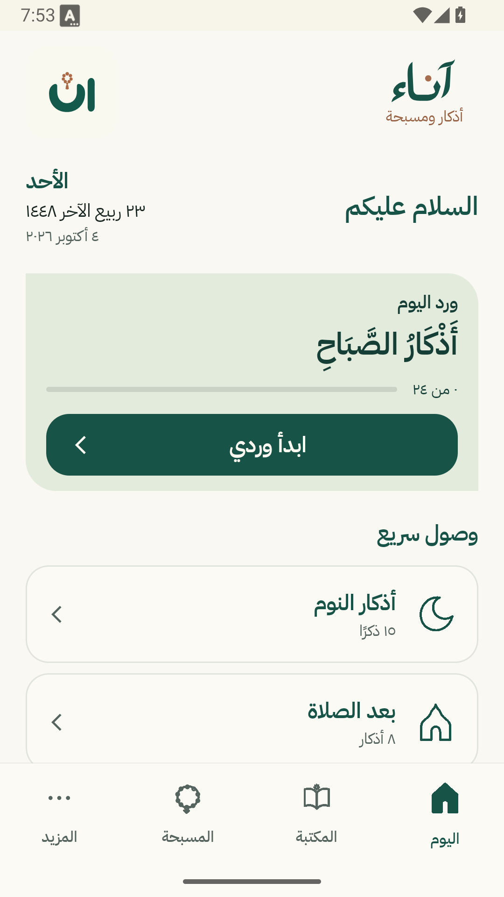
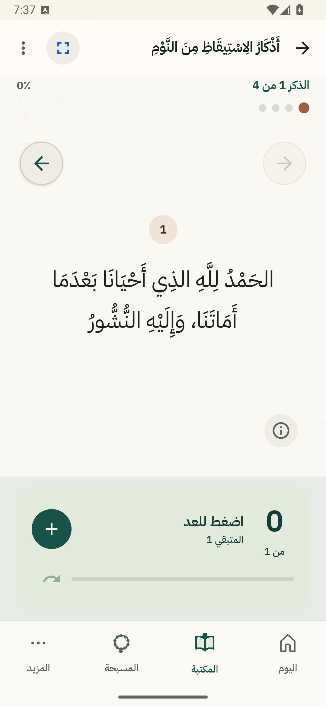
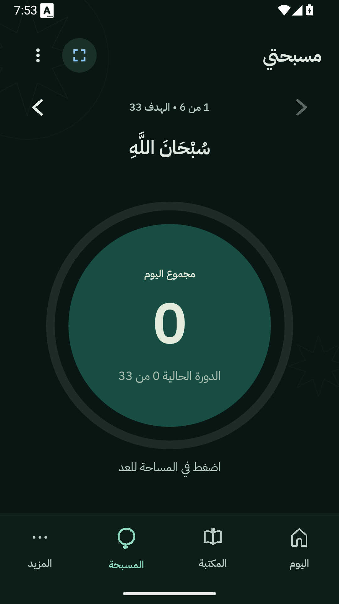
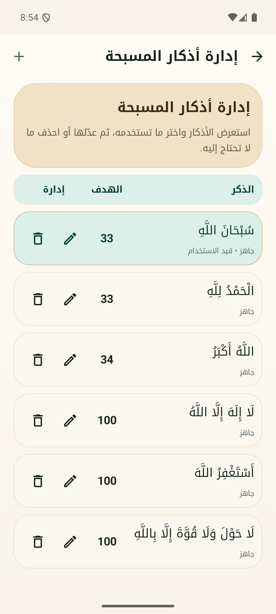

# آناء — أذكار ومسبحة

[العربية](#العربية)

[English](#english)

<a id="العربية"></a>

<div dir="rtl">

> آناء تطبيق عربي أصلي للأذكار اليومية، وكتاب حصن المسلم، والمسبحة. يعمل محليًا، بلا حساب، وبلا إعلانات أو اشتراكات.

## المشروع متاح للجميع

هذا المستودع هو المصدر الكامل للتطبيق، ومتاح بموجب ترخيص **MIT**. يمكنك قراءته، تشغيله، تعديله، ونشر نسخ مشتقة منه وفق شروط الترخيص.

التطبيق لا يطلب صلاحية الإنترنت لتشغيل محتواه؛ النصوص والإعدادات والتقدم تحفظ محليًا على الجهاز. لا توجد حسابات مستخدمين أو خدمة خلفية أو تتبع إعلاني.

## المزايا

- 133 بابًا و302 ذكرًا ودعاءً من حصن المسلم، مع التكرار والمصادر.
- وصول سريع إلى أذكار الصباح والمساء والنوم وما بعد الصلاة.
- قارئ مخصص يحفظ التقدم، ويحسب التكرارات، ويدعم المفضلة والتشكيل وحجم الخط.
- بحث عربي يتسامح مع اختلاف الهمزات والتشكيل.
- مسبحة حرة بأهداف جاهزة أو هدف يحدده المستخدم.
- إدارة مستقلة لأذكار المسبحة: إضافة وتعديل وحذف، مع توقف التنقل عند أول ذكر وآخره.
- واجهة عربية من اليمين إلى اليسار، وخطوط مناسبة للنصوص العربية، وخيار الألوان الديناميكية والوضع الداكن.

يبقى نطاق آناء مقصودًا ومركزًا: الذكر والقراءة والتسبيح، من دون أقسام جانبية مشتتة.

## صور من التطبيق

<table>
  <tr>
    <td align="center"><br>الشاشة الرئيسية</td>
    <td align="center"><br>قارئ الأذكار</td>
  </tr>
  <tr>
    <td align="center"><br>المسبحة</td>
    <td align="center"><br>إدارة أذكار المسبحة</td>
  </tr>
</table>

## التقنية

- Kotlin
- Jetpack Compose وMaterial 3
- Navigation 3
- DataStore لحفظ الإعدادات والمفضلة والتقدم وبيانات المسبحة محليًا
- Room للبيانات المحلية
- محتوى عربي محلي داخل التطبيق عبر ملف `hisn_ar.json`

الحد الأدنى للنظام هو Android 8.0، ومستوى واجهة البرمجة 26.

## التشغيل محليًا

المتطلبات:

- JDK 17
- Android SDK Platform 37
- محاكي أو جهاز يعمل بنظام Android 8.0 أو أحدث

افتح المشروع في بيئة التطوير المناسبة، أو شغّل الأمر التالي من جذر المستودع:

```powershell
.\gradlew.bat testDebugUnitTest assembleDebug
```

لا يحتاج المشروع إلى مفتاح API أو متغيرات سرية.

لتشغيل اختبارات الواجهة على محاكي أو جهاز متصل:

```powershell
.\gradlew.bat connectedDebugAndroidTest
```

## الخصوصية

- لا يتطلب التطبيق إنشاء حساب.
- لا يتضمن إعلانات أو تحليلات أو اشتراكات.
- لا يطلب صلاحية الإنترنت لتشغيل المحتوى.
- تحفظ تفضيلات القراءة والمسبحة والتقدم محليًا على الجهاز.

البيان الكامل:

[سياسة الخصوصية](PRIVACY_POLICY.md)

## المحتوى والتراخيص

الكود الأصلي لهذا المشروع مرخص بموجب [MIT](LICENSE).

تحتفظ بيانات حصن المسلم والخطوط المضمنة بتراخيصها الخاصة. راجع [إشعارات الأطراف الثالثة](THIRD_PARTY_NOTICES.md) للمصادر والتراخيص وسجل التحقق.

ينبغي التعامل مع أي تصحيح ديني أو تعديل للنصوص بعناية، مع إرفاق مصدر يمكن مراجعته.

## المساهمة والدعم

نرحب بالتقارير والتحسينات والمساهمات المدروسة. يرجى قراءة [دليل المساهمة](CONTRIBUTING.md) قبل فتح طلب دمج.

للأسئلة أو الإبلاغ المسؤول عن مشكلة أمنية أو خصوصية:

<a href="mailto:info@cdit.co">info@cdit.co</a>

<a href="https://cdit.co/contact.html">صفحة التواصل</a>

التطوير بواسطة مؤسسة إبداع التطوير والبرمجة لتقنية المعلومات.

## الإصدار

الإصدار الحالي هو ١.٣.٣، ورقم البناء ٧، وتاريخ الإصدار ٤ أكتوبر ٢٠٢٦.

راجع [سجل التحديثات](CHANGELOG.md) للاطلاع على تغييرات هذا الإصدار.

للتثبيت والتحديث على الجوال، استخدم [متجر قوقل](https://play.google.com/store/apps/details?id=com.sakinah.tasbih). ملفات التثبيت المحلية الموقعة بمفتاح الرفع تستخدم توقيعًا مختلفًا عن نسخ المتجر، ولا يمكن تبديل مصدر التثبيت بهذه الملفات كتحديث مباشر. راجع [دليل توافق التحديثات](docs/releases/update-compatibility.md) قبل استخدام ملف تثبيت مباشر.

</div>

<a id="english"></a>

## English

Anaa is a native Arabic-first Android app for daily adhkar, Hisn al-Muslim content, and personal tasbih sessions. It works locally with no account, ads, subscriptions, or network permission required for its content.

### Highlights

- 133 chapters and 302 adhkar and du'a entries.
- Focused reader with progress, repetition, favorites, tashkeel, and text-size controls.
- Arabic-aware search.
- A flexible tasbih with editable phrases and bounded previous/next navigation.
- Local-first settings and progress storage.
- RTL-first interface built with Kotlin and Jetpack Compose.

### Current release

Version 1.3.3, build 7, released October 4, 2026. See [the changelog](CHANGELOG.md).

Install and update through [Google Play](https://play.google.com/store/apps/details?id=com.sakinah.tasbih). Locally built APKs use the upload key, while Play-distributed APKs use Google's app signing key; those APKs cannot replace each other as updates. See [update compatibility](docs/releases/update-compatibility.md) before using a direct APK.

### Build

Requirements: JDK 17, Android SDK Platform 37, and Android 8.0 / API 26 or newer.

```powershell
.\gradlew.bat testDebugUnitTest assembleDebug
```

Run connected UI tests with:

```powershell
.\gradlew.bat connectedDebugAndroidTest
```

### License and attribution

The project source code is released under the [MIT License](LICENSE). See [Third-Party Notices](THIRD_PARTY_NOTICES.md) for the bundled Hisn al-Muslim data and font licenses.

### Privacy

Read the app-specific [Privacy Policy](PRIVACY_POLICY.md).

### Contributing

Please read [CONTRIBUTING.md](CONTRIBUTING.md) before submitting a change. Security or privacy reports can be sent to <a href="mailto:info@cdit.co">info@cdit.co</a>.
