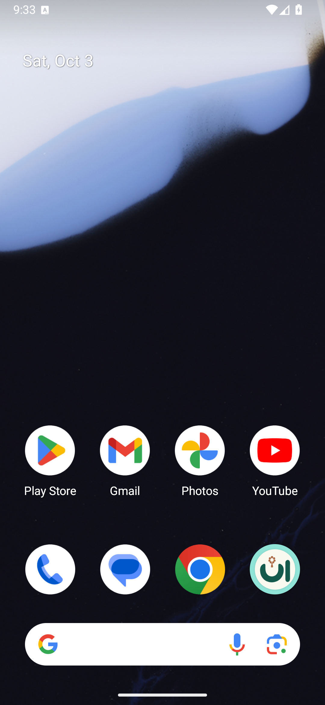

# اعتماد أيقونة الألف والنون والمسبحة

اعتمد المستخدم النسخة المعدلة الأولى يوم ٣ أكتوبر ٢٠٢٦: ألف ونون باللون الأخضر ومسبحة نحاسية بدل نقطة النون، على خلفية عاجية.


## التطبيق

استُخرجت حدود الرسم المعتمد إلى موارد متجهة لأيقونة التشغيل، مع الحفاظ على الألف والنون وحبات المسبحة والشرابة. اختيرت الألوان من ألوان الرسم الأصلي. للنسخة الملونة خلفية وطبقة أمامية منفصلتان؛ وتستخدم النسخة الأحادية اللون الحدود نفسها.

حُجّم الرسم ليقع كاملًا داخل دائرة الأمان بقطر ٦٦ وحدة، وفق [إرشادات أندرويد الحالية للأيقونات](https://developer.android.com/develop/ui/compose/system/icon_design_adaptive). أقصى بعد عن المركز بعد التحجيم يساوي ٣٢٫٨٢ وحدة. تستعمل أيقونتا التشغيل العادية والدائرية الطبقات الجديدة، وتشير شاشة البدء إلى الأيقونة نفسها في المظهرين الفاتح والداكن.

نجح بناء نسختي التطوير والإصدار الموقّع وفحص توقيع الإصدار. نُسخ ملف المتجر المعتمد بمقاس ٥١٢ × ٥١٢ دون تعديل، وفُحص تطابق محتواه مع التصدير المعتمد وكون الخلفية مصمتة.

حُدّث المحاكي مع التحقق من تطابق بصمة ملف الإعدادات قبل التثبيت وبعده، ثم فُحص ظهور الألف والنون والمسبحة كاملة في أيقونة الشاشة الرئيسية. تتضمن نسخة التطبيق إصلاحات انتقال الأذكار وشريط التنقل السابقة.



## ملفات التحقق

- [فحص الأصول والأبعاد ودائرة الأمان](asset-verification.json)
- [نتيجة فحص الحفاظ على بيانات المحاكي](data-preservation-summary.json)
- [فحص البناء والتوقيع](build-verification.json)
- [الأيقونة المعتمدة للمتجر](../../store-assets/app-icon.png)
- [المصدر المتجهي المستخرج من الحدود المعتمدة](../../store-assets/app-icon.svg)
- [أداة تصدير الموارد المتجهة](../../tools/export_approved_icon.py)
- [المواد السابقة قبل الاستبدال](previous/)

## نسخة التطبيق

```text
Package: com.sakinah.tasbih
Version name: 1.3.1
Version code: 5
Artifact: dist/Anaa-1.3.1-approved-icon.apk
SHA-256: DBC411A1356ACBAD03B99FA6A71DB9491D9BA46690AE9D27A3795FD3E952E3A9
Upload certificate SHA-256: 71E5718995852EF2B26596BF95F81552017E129763E6275F854A3AC623D588BD
```

اسم التطبيق داخليًا «آناء». عنوان المتجر «اناء» وفق طلب الاقتصار على تغيير اسم المتجر. هذه حزمة محلية موقّعة؛ لم تُرفع حزمة تطبيق جديدة إلى المتجر في هذا التعديل.

## صفحة المتجر

رُفع ملف الأيقونة المعتمد، مع إقرار إنشائه أو تعديله باستخدام الذكاء الاصطناعي، وحُفظ التغيير ثم أُرسل طلب المراجعة. بعد الفحوصات الأولية، أكدت لوحة النشر أن التغيير أصبح قيد المراجعة. يتضمن الطلب تغيير أيقونة صفحة المتجر العربية فقط؛ ظهور الأيقونة الجديدة للجمهور يحتاج إلى موافقة المتجر.

حُفظت لقطة إثبات المراجعة محليًا. يمكن لصاحب التطبيق متابعة الحالة من [لوحة النشر](https://play.google.com/console/u/0/developers/8104646540488178010/app/4973814989832211416/publishing).
